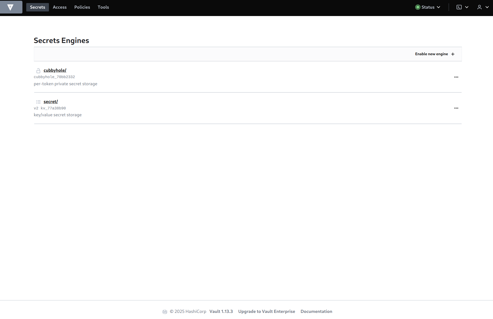

# РТ 1 Лаба   
```
pacman -S minikube
minikube start
minikube kubectl -- create -f vault_pod.yml

```
```
apiVersion: v1
kind: Pod
metadata:
  name: vault
  labels:
    name: vault
spec:
  containers:
  - name: vault
    image: vault:1.13.3
    ports:
    - containerPort: 8200

```
```
minikube kubectl -- expose pod vault --type=NodePort --port=8200
minikube kubectl -- port-forward service/vault 8200:8200
minikube kubectl -- logs vault

```
    

$$
flowchart TB
    subgraph Minikube
        subgraph Laptop
        direction LR
        M[kubelet]
            subgraph vault_pod
                vault_container
            end
        end
    end

classDef plain fill:#fff,stroke:#000,stroke-width:1px,color:#000
classDef spacewhite fill:#ffffff,stroke:#fff,stroke-width:0px,color:#000
classDef k8s fill:#326ce5,stroke:#fff,stroke-width:4px,color:#fff;

class vault_container,vault_pod,Minikube,Laptop plain
class M k8s
$$
   
