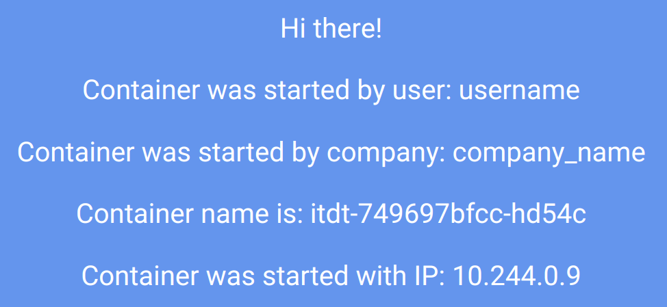

# РТ 2 Лаба   
```
kctl apply -f itdt.yml
kctl apply -f itdt_service.yaml
kctl port-forward service/node-port 3000:3000
kctl logs itdt-749697bfcc-hd54c

```
```
apiVersion: apps/v1
kind: Deployment
metadata:
  name: itdt
spec:
  replicas: 2
  selector:
    matchLabels:
      app: itdt
  template:
    metadata:
      labels:
        app: itdt
    spec:
      containers:
        - name: itdt
          image: ifilyaninitmo/itdt-contained-frontend:master
          env:
            - name: REACT_APP_USERNAME
              value: username
            - name: REACT_APP_COMPANY_NAME
              value: company_name
          ports:
            - containerPort: 3000


```
```
apiVersion: v1
kind: Service
metadata:
  name: node-port
spec:
  type: NodePort
  ports:
    - port: 3000
      targetPort: 3000
      protocol: TCP
  selector:
    app: itdt

```
    
```
Builing frontend
Browserslist: caniuse-lite is outdated. Please run:
  npx update-browserslist-db@latest
  Why you should do it regularly: https://github.com/browserslist/update-db#readme
Browserslist: caniuse-lite is outdated. Please run:
  npx update-browserslist-db@latest
  Why you should do it regularly: https://github.com/browserslist/update-db#readme
build finished
Server started on port 3000

```

$$
flowchart LR
    subgraph Minikube
        subgraph Deployment
            subgraph ReplicaSet
                pod1
                pod2
            end
        end
        service
    end
    browser --get container--> service
    browser --port forward--> pod1
    service --> pod1
    service --> pod2


$$
   
