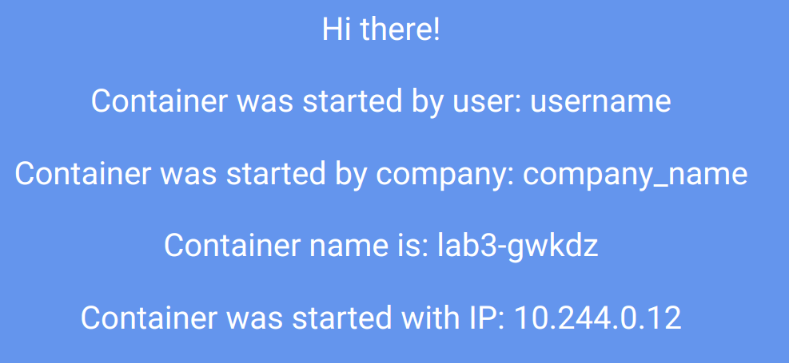

# РТ 3 Лаба   
```
kctl apply -f itdt_3.yml
minikube addons enable ingress
openssl req -x509 -new -nodes -newkey rsa:2048 -days 999 -subj "/CN=lab3.local" -out ca.crt
kctl -n default create secret tls mkcert --key privkey.pem --cert ca.crt
minikube addons configure ingress
kctl apply -f ingress.yml
kctl get ingress lab3-ingress
echo 192.168.49.2 lab3.local >> /etc/hosts
```
```
apiVersion: v1
kind: ConfigMap
metadata:
  name: cm-lab3
data:
  REACT_APP_USERNAME: username
  REACT_APP_COMPANY_NAME: company_name
---
apiVersion: apps/v1
kind: ReplicaSet
metadata:
  name: lab3
  labels:
    app: lab3
spec:
  replicas: 2
  selector: 
    matchLabels:
      app: lab3
  template:
    metadata:
      labels:
        app: lab3
    spec:
      containers:
        - name: lab3
          image: ifilyaninitmo/itdt-contained-frontend:master
          env:
            - name: REACT_APP_USERNAME
              valueFrom:
                configMapKeyRef:
                  name: cm-lab3
                  key: REACT_APP_USERNAME
            - name: REACT_APP_COMPANY_NAME
              valueFrom:
                configMapKeyRef:
                  name: cm-lab3
                  key: REACT_APP_COMPANY_NAME
          ports:
            - containerPort:  3000
---
apiVersion: v1
kind: Service
metadata:
  name: lab3
spec:
  type: NodePort
  selector:
    app: lab3
  ports:
    - protocol: TCP
      port: 3000
      targetPort: 3000

```
```
apiVersion: networking.k8s.io/v1
kind: Ingress
metadata:
  name: lab3-ingress
spec:
  tls:
    - hosts:
        - lab3.local
      secretName: mkcert
  rules:
    - host: lab3.local
      http:
        paths:
          - path: /
            pathType: Prefix
            backend:
              service:
                name: lab3
                port:
                  number: 3000

```
    
    
 


