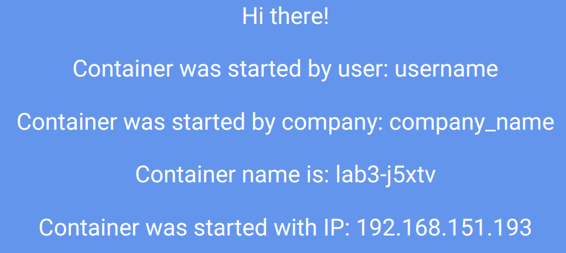

# РТ 4 Лаба   
```
minikube start --network-plugin=cni --cni=calico --nodes 2 -p lab4
minikube profile lab4
kctl get pods -n kube-system -l k8s-app=calico-node
  NAME                READY   STATUS    RESTARTS   AGE
  calico-node-j2qw2   1/1     Running   0          40s
  calico-node-t9tph   1/1     Running   0          36s
kubectl get nodes
  NAME       STATUS   ROLES           AGE     VERSION
  lab4       Ready    control-plane   3m11s   v1.31.0
  lab4-m02   Ready    <none>          2m59s   v1.31.0
kubectl label nodes lab4 zone=A
kubectl label nodes lab4-m02 zone=B
calicoctl delete ippools default-ipv4-ippool --allow-version-mismatch
calicoctl apply -f calico_pools.yml --allow-version-mismatch
calicoctl get ippool -o wide --allow-version-mismatch
  NAME             CIDR               NAT    IPIPMODE   VXLANMODE   DISABLED   DISABLEBGPEXPORT   SELECTOR
  central-ippool   192.168.150.0/24   true   Always     Never       false      false              zone == "A"
  east-ippool      192.168.151.0/24   true   Always     Never       false      false              zone == "B"
kctl apply -f itdt_3.yml
kubectl port-forward service/lab3 3000:3000
kubectl get pods -o wide
  NAME         READY   STATUS    RESTARTS   AGE     IP                NODE       NOMINATED NODE   READINESS GATES
  lab3-j5xtv   1/1     Running   0          2m32s   192.168.151.193   lab4-m02   <none>           <none>
  lab3-zs5ms   1/1     Running   0          2m32s   192.168.150.1     lab4       <none>           <none>
kctl exec --stdin --tty lab3-j5xtv -- sh
/frontend # ping 192.168.150.1
  PING 192.168.150.1 (192.168.150.1): 56 data bytes
  64 bytes from 192.168.150.1: seq=0 ttl=62 time=0.098 ms
  64 bytes from 192.168.150.1: seq=1 ttl=62 time=0.104 ms
  ^C
  --- 192.168.150.1 ping statistics ---
  2 packets transmitted, 2 packets received, 0% packet loss
  round-trip min/avg/max = 0.098/0.101/0.104 ms


```
```
apiVersion: projectcalico.org/v3
kind: IPPool
metadata:
    name: central-ippool
spec:
    cidr: 192.168.150.0/24
    ipipMode: Always
    natOutgoing: true
    nodeSelector: zone == "A"
---
apiVersion: projectcalico.org/v3
kind: IPPool
metadata:
    name: east-ippool
spec:
    cidr: 192.168.151.0/24
    ipipMode: Always
    natOutgoing: true
    nodeSelector: zone == "B"

```
    

$$
flowchart LR
    subgraph Minikube
            subgraph ReplicaSet
               subgraph zone_A
                pod1
                end
               subgraph zone_B
                pod2
                end
            end
        service
    end
    browser --get container--> service
    browser --port forward--> pod1
    service --> pod1
    service --> pod2


$$
   
